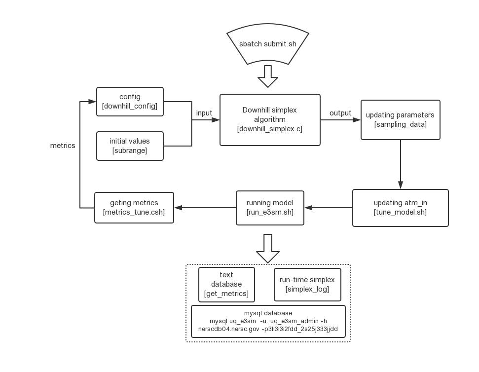
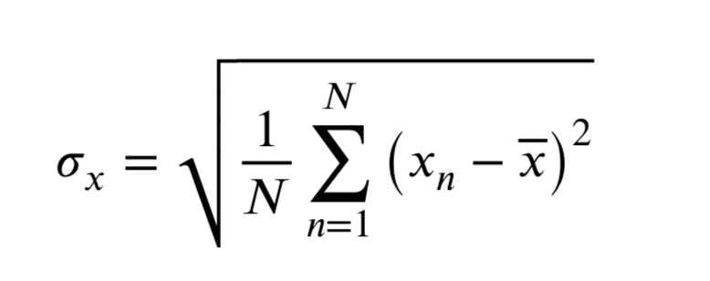
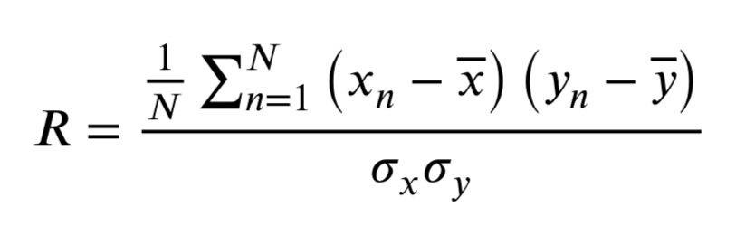
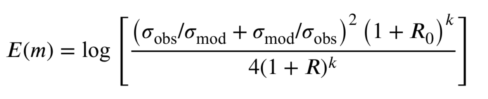

# Parameter calibartion package used in E3SM
                        Tao Zhang (slnazhangtao@gmail.com) 
                                        05/03/2019

## Where the package
/global/homes/z/zhangtao/ACME/GCM_paras_tune/algorithms/downhill_simplex/model

## Structure of the package


## Configuration for downhill simplex algorithm
File: downhill_config

```
1000     #maximum iterations
8        #number of parametes
10e-8    #threshold for convergency 
/global/cscratch1/sd/zhangtao/acme_scratch/cori-knl/low_ne30/run/tune_model.sh     #low res model startup
/global/cscratch1/sd/zhangtao/acme_scratch/cori-knl/low_ne30/run/metrics/TWP/mcpi  #TWP score of low res
/global/cscratch1/sd/zhangtao/acme_scratch/cori-knl/high_twpx4v1/run/tune_model.sh #high res model startup 
/global/cscratch1/sd/zhangtao/acme_scratch/cori-knl/low_ne30/run/metrics/Global/mcpi #Global score of low res
/global/cscratch1/sd/zhangtao/acme_scratch/cori-knl/high_twpx4v1/run/metrics/score #TWP score of high res 
```

## Initial values for downhill simplex algorithm
File: subrange 
```
-2e-3 -1e-4    #begin  parameter range
0.001 0.007
0.001 0.007
0.02  0.1
1 5
2 8
0.5 2
350 1400    #end parameter range 
#Parameter initial values (N+1), N is the number of parameters. For the inital run, the shape is (N+1)xN.
#When known the corresponding metrics, the shape is (N+1)x(N+1), the last column is the metrics values. 
-8.81E-04   4.13E-03    6.72E-03    7.67E-02    1.12E+00    2.00E+00    8.61E-01    3.64E+02    6.41E-01
-7.78E-04   3.80E-03    6.23E-03    7.87E-02    1.11E+00    2.00E+00    8.33E-01    3.63E+02    7.04E-01
-9.25E-04   4.15E-03    6.78E-03    7.47E-02    1.12E+00    2.00E+00    8.63E-01    3.63E+02    7.20E-01
-8.75E-04   4.11E-03    6.66E-03    7.56E-02    1.12E+00    2.00E+00    8.59E-01    3.65E+02    6.40E-01
-9.75E-04   4.20E-03    6.89E-03    7.38E-02    1.11E+00    2.00E+00    8.68E-01    3.60E+02    8.22E-01
-1.18E-03   3.69E-03    6.45E-03    7.94E-02    1.10E+00    2.00E+00    8.66E-01    3.60E+02    7.19E-01
-1.00E-04   4.15E-03    6.73E-03    7.62E-02    1.12E+00    2.00E+00    8.63E-01    3.65E+02    3.11E+02
-1.00E-04   4.07E-03    6.65E-03    7.63E-02    1.12E+00    2.00E+00    8.58E-01    3.64E+02    3.12E+02
-8.78E-04   4.12E-03    6.69E-03    7.62E-02    1.12E+00    2.00E+00    8.60E-01    3.65E+02    9.20E+00

```
## Downhill simplex algorithm
File: downhill_simplex.c
### For the inital run, reading the parameter initial value. 
```c
read_init(){
    ...
    for(i = 0; i < NDIM + 1; i++){
        for(j = 0; j < NDIM; j++){
            if(j != NDIM){
                 fscanf(fp_config, "%lf", &INIT_Paras[i][j]);
                 printf("%e ", INIT_Paras[i][j]);
              }
              else{
                  fscanf(fp_config, "%lf", &INIT_Metrics[i]);
              }
          }
          printf("\n");
      }
      
      for(i = 0; i < NDIM + 1; i++){
          INIT_Metrics[i] = get_metrics(INIT_Paras[i]);
          printf("%e \n",INIT_Metrics[i]);
      }
      ...
  }
```
### When known the corresponding metrics
```c
read_init(){
    ...
    for(i = 0; i < NDIM + 1; i++){
        for(j = 0; j < NDIM+1; j++){
            if(j != NDIM){
                 fscanf(fp_config, "%lf", &INIT_Paras[i][j]);
                 printf("%e ", INIT_Paras[i][j]);
              }
              else{
                  fscanf(fp_config, "%lf", &INIT_Metrics[i]);
              }
          }
          printf("\n");
      }
      
      for(i = 0; i < NDIM + 1; i++){
          //INIT_Metrics[i] = get_metrics(INIT_Paras[i]);
          printf("%e \n",INIT_Metrics[i]);
      }
      ...
  }
```
## updating parameter values in atm_in
File: tune_model.sh
```bash
#!/bin/bash
# parameter list
paras="zmconv_dmpdz:zmconv_c0_ocn:zmconv_c0_lnd:cldfrc_dp1:clubb_c1:clubb_c8:clubb_c14:ice_sed_ai"
# updating parameter values, which are generated by downhill simplex algorithm
sampling_file="sampling_data"
# the directory of the sampling file
sample_dir="/global/homes/z/zhangtao/ACME/GCM_paras_tune/algorithms/downhill_simplex/model/"
# the directory of the "run_e3sm.sh" file, which is to start the E3SM. 
run_dir="/global/cscratch1/sd/zhangtao/acme_scratch/cori-knl/low_ne30/run/"
# the metrics directory
metrics_path="$run_dir/metrics"

#undating the parameter values in atm_in 
cd  $run_dir
paras_num=`echo $paras | awk -F ':' '{print NF}'`
for i in `seq 1 $paras_num`
do
    para=`echo $paras |cut -d : -f $i`
    var_line=`sed -n "1p" $sample_dir/$sampling_file`
    para_val="$para=`echo $var_line |cut -d ' ' -f $i`"
    echo $para_val
    sed -i "/\<$para\>/c \\  $para_val" $run_dir/atm_in
done

# run the E3SM 
./run_e3sm.sh
wait

# convert the output into the formate by lat x lon 
echo "e3sm has finished running!"
./remap_2d.sh low_ne30.cam.h1.2009-07*nc
./remap_2d.sh low_ne30.cam.h0*

# compute the metrics score 
cd $metrics_path/TWP
./metrics_tune.csh > metrics.log
cd $metrics_path/Global
./metrics_tune.csh > metrics.log
```
## runing E3SM model
File:  run_e3sm.sh
```bash
# set OpenMP environment variables
export 'OMP_STACKSIZE'='128M'
export 'OMP_PROC_BIND'='spread'
export 'OMP_NUM_THREADS'='4'
export 'OMP_PLACES'='threads'
# run E3SM model
srun  --label  -n 2560 -c 4  --cpu_bind=cores  /global/cscratch1/sd/zhangtao/acme_scratch/cori-knl/low_ne30/bld/e3sm.exe
```
## getting matrics
File: metrics_tune.csh, calc_metrics_tune.ncl
The metrics_tune.csh 
1. computes the climatology mean of model simulation outputs
2. calls the "calc_metrics_tune.ncl", computes the performance score compared with obs
    - The standard deviation of variable x 
      
    - The correlation coefficient between variable x and variable y
    
    - Loss function E(m): 
    
    where the model simulation and observation are represented by "mod" and "obs", respectively. $R_0$ is the maximum value of the correlation coefficient (Here $R_0=1$).  k is used to control the weight of spatial correlation (Here $k=4$). The lower of E(m), the better of simulation performance. 
    - Merge multi-variable into a one-objective
    
    where $N^F$ is the number of variables, $E_m^F$ is the tuning model simulation, $E_r^F$ is the default model simulation. If $\chi < 1$, tuning simulation is better than the default simulation. The smaller of this value, the better of the tuning performance. 

3. Record the parameter values and the corrsponding metrics into the MySQL database. 
```bash 
mysql uq_e3sm  -u  uq_e3sm_admin -h nerscdb04.nersc.gov -p3Ii3i3i2fdd_2s25j333jjdd < metrics.sql
```
## Accessing the MySQL Database
```bash
mysql uq_e3sm  -u  uq_e3sm_admin -h nerscdb04.nersc.gov -p3Ii3i3i2fdd_2s25j333jjdd < metrics.sql
```
```sql
select id,c0_ocn,c0_lnd,PRECT,CLDHGH,CLDLOW,CLDMED,LWCF,SWCF,MCPI,NOTE,date from e3sm_tune_MOO;
```

## Compile the downhill simplex algorithm
File: downhill_simplex.c
```bash
gcc -o downhill_simplex downhill_simplex.c -lm  -g
```

## Submit the calibration package 
File: submit.sh
```bash 
sbatch submit.sh 
``` 
